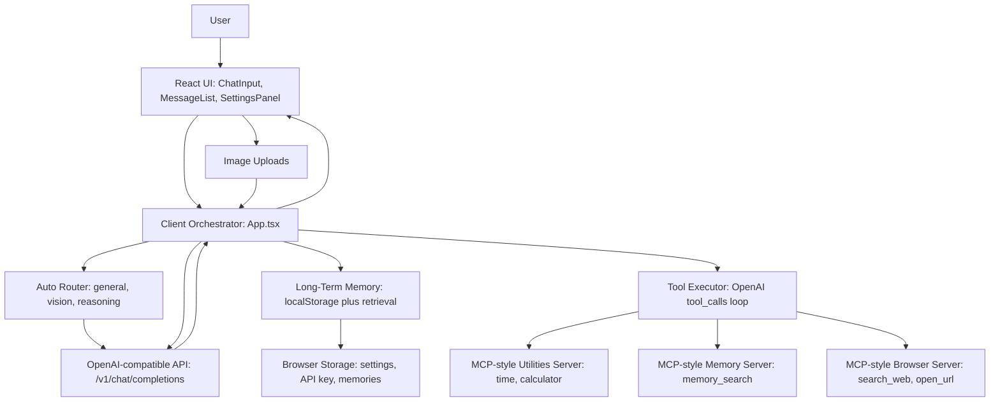

# LLM Chatroom v2: System Architecture Diagram

## Component Summary

- `React UI`: receives user text, image uploads, and settings changes
- `Client Orchestrator`: coordinates routing, payload building, streaming, tool loops, and UI state
- `Auto Router`: selects the general, vision, or reasoning model based on the turn
- `Long-Term Memory`: stores and retrieves user facts from browser storage
- `Tool Executor`: handles OpenAI-style function calls and returns tool outputs back to the model
- `MCP-style Servers`: modular groups of local tools for utility, memory, and browser tasks
- `OpenAI-compatible API`: performs generation for both text-only and multimodal requests

## Request Flow

1. User enters text or attaches an image.
2. The client router selects the best model.
3. Relevant long-term memories are retrieved.
4. The request is sent to the chat-completions API.
5. If the model requests tools, the tool executor runs them locally and continues the loop.
6. The final answer is rendered in the chat interface, and new durable memories may be stored.
